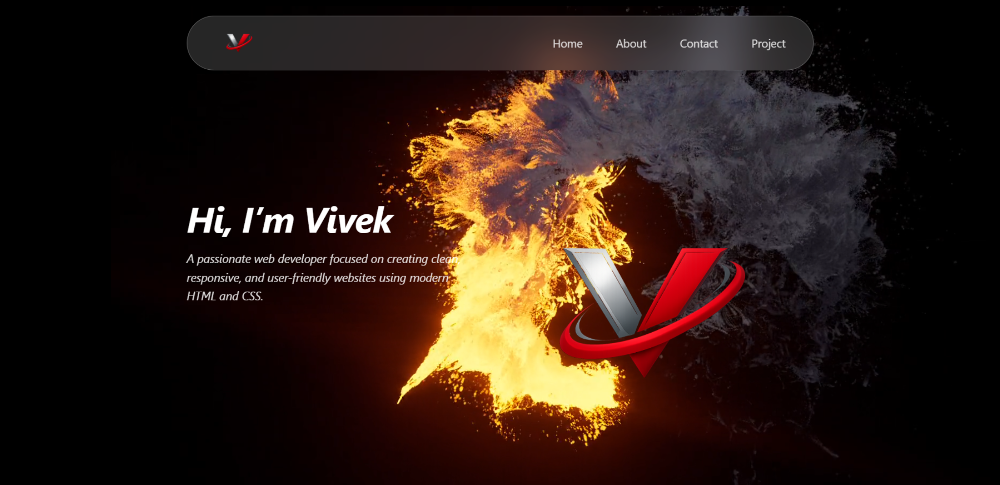
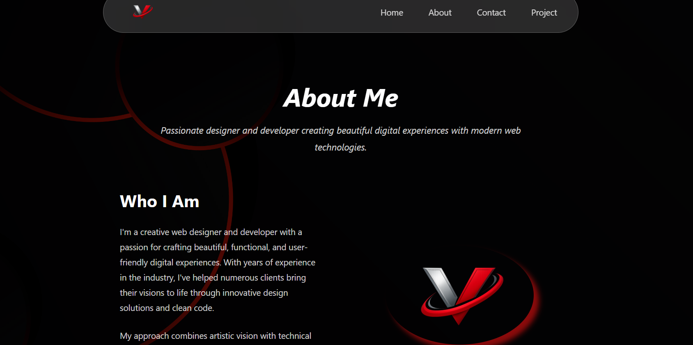
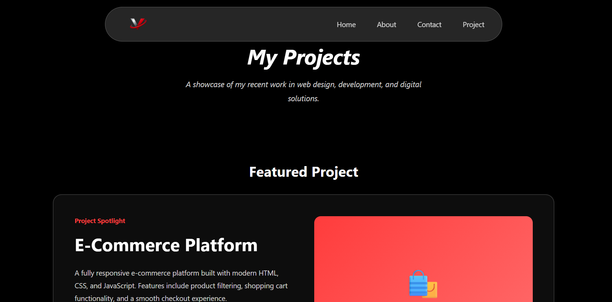
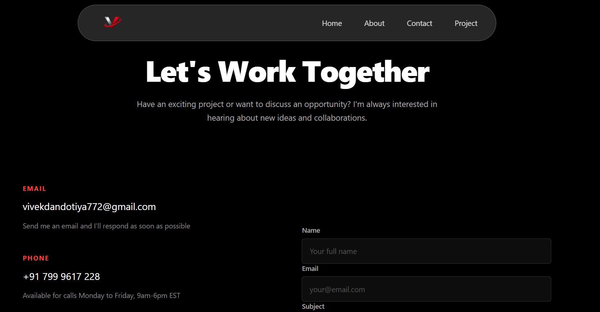

# Vivek – Personal Portfolio Website

A modern, responsive personal portfolio website showcasing my skills, projects, and contact information.  
This project is built using pure HTML and CSS with a dark-themed UI and smooth visual effects.

---

📖 Project Description

This portfolio website represents my personal brand as a web developer.  
It includes:

- A Home page with an introduction and hero section
- A About page describing who I am and my skills
- A Projects page showcasing featured work
- A Contact page with contact details and a message form

The design focuses on clean layout, dark UI, and modern visuals.

---

 🛠 Tech Stack

- HTML5
- CSS3
- No frameworks
- No JavaScript (pure CSS-based UI)

---

📸 Screenshots

 Home Page

 About Page

 Projects Page

 Contact Page

🌐 Live Website

🔗 **GitHub Pages Live Link**  
https://vivekdandotiya.github.io/Vivek/ 

---
 🎯 Features Implemented

- Responsive navigation bar
- Dark-themed modern UI
- Glassmorphism-style navbar
- CSS hover effects
- Structured multi-page layout

---

📚 What I Learned

Through this project, I learned:

- How to structure a multi-page website
- Proper use of CSS layouts and positioning
- Creating modern UI using pure CSS
- Managing a project with Git and GitHub
- Hosting a website using GitHub Pages

---

👤 Author

-Vivek Dandotiya
📧 Email: vivekdandotiya772@gmail.com  
🔗 GitHub: https://github.com/vivekdandotiya 
