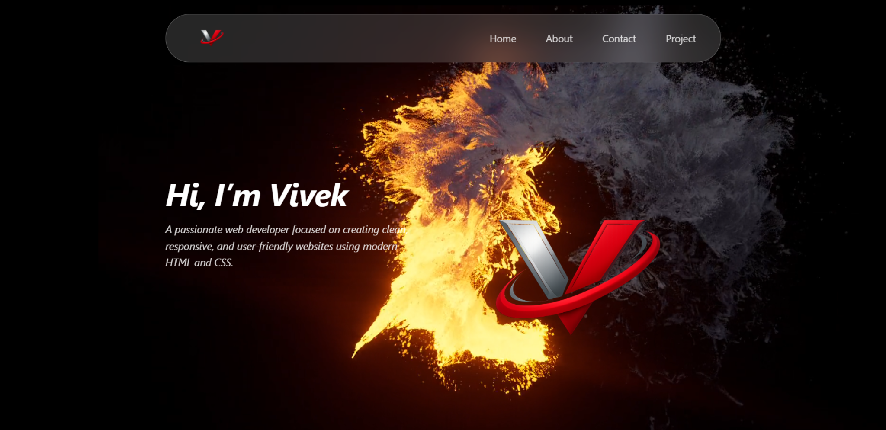
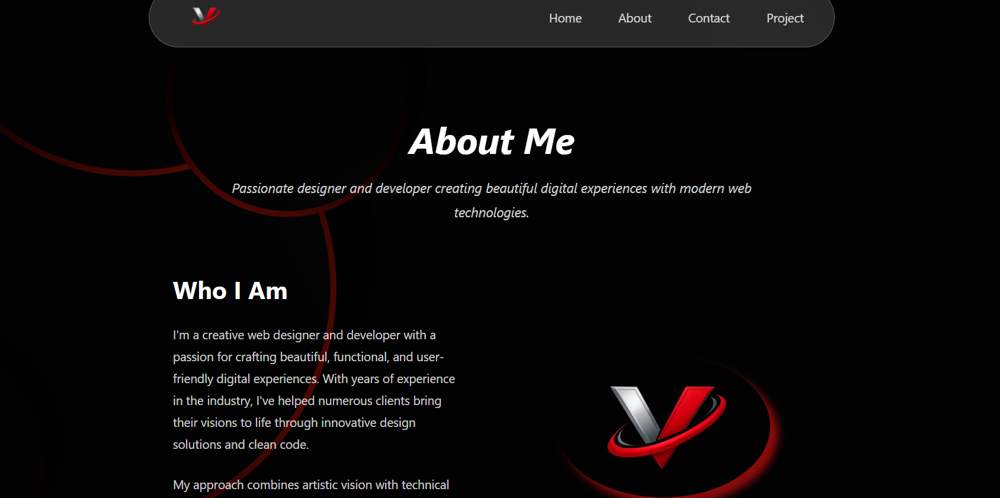
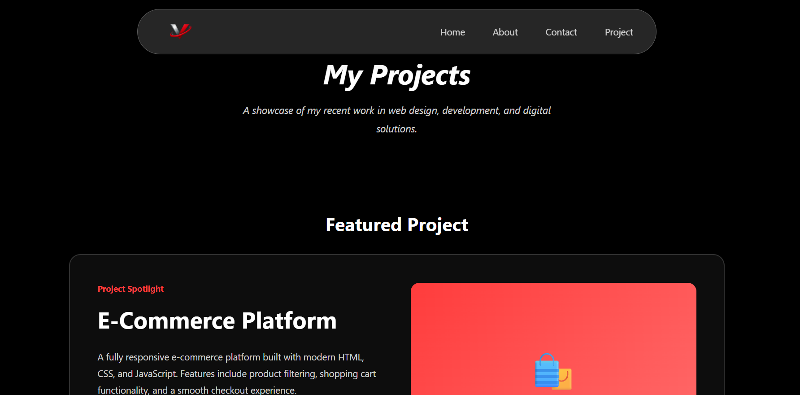
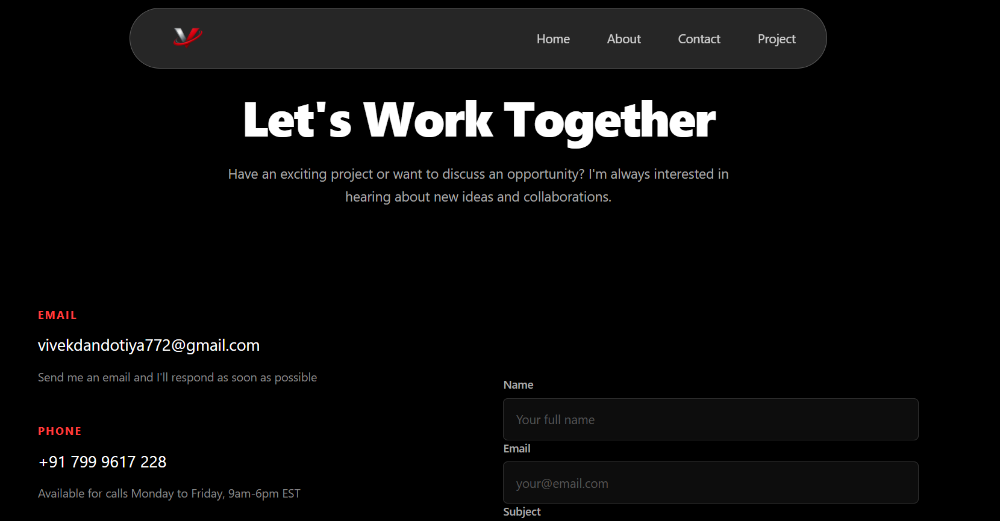

# Vivek – Personal Portfolio Website

A modern, responsive personal portfolio website showcasing my skills, projects, and contact information.  
This project is built using pure HTML and CSS with a dark-themed UI and smooth visual effects.

---

📖 Project Description

This portfolio website represents my personal brand as a web developer.  
It includes:

- A Home page with an introduction and hero section
- A About page describing who I am and my skills
- A Projects page showcasing featured work
- A Certifications page showcasing verified credentials with an interactive split-panel lightbox viewer
- A Contact page with contact details and a message form

The design focuses on clean layout, dark UI, and modern visuals.

---

 🛠 Tech Stack

- HTML5
- CSS3 / Glassmorphism
- JavaScript (for interactive filters, 3D tilt card hover, search, and immersive lightbox)
- Python / Pillow (for custom certificate asset generation)

---

📸 Screenshots

 Home Page

 About Page

 Projects Page

 Contact Page

---

🌐 Live Website

🔗 **GitHub Pages Live Link**  
https://vivekdandotiya.github.io/Vivek/ 

---
 🎯 Features Implemented

- Responsive navigation bar
- Dark/Light themed modern glassmorphic UI
- Interactive Bento Grid layout for certifications
- 3D Card Hover Tilt and reflection effects
- Advanced search and category filtering for credentials
- Immersive split-view Lightbox with zoom controls and metadata panel
- Structured multi-page layout

---

📚 What I Learned

Through this project, I learned:

- How to structure a multi-page website
- Proper use of CSS layouts and positioning
- Creating modern glassmorphic UI elements
- Implementing interactive JavaScript filters, search engines, and modal controllers
- Dynamically generating image assets with Python's PIL library
- Managing a project with Git and GitHub
- Hosting a website using GitHub Pages

---

👤 Author

-Vivek Dandotiya
📧 Email: vivekdandotiya772@gmail.com  
🔗 GitHub: https://github.com/vivekdandotiya 
